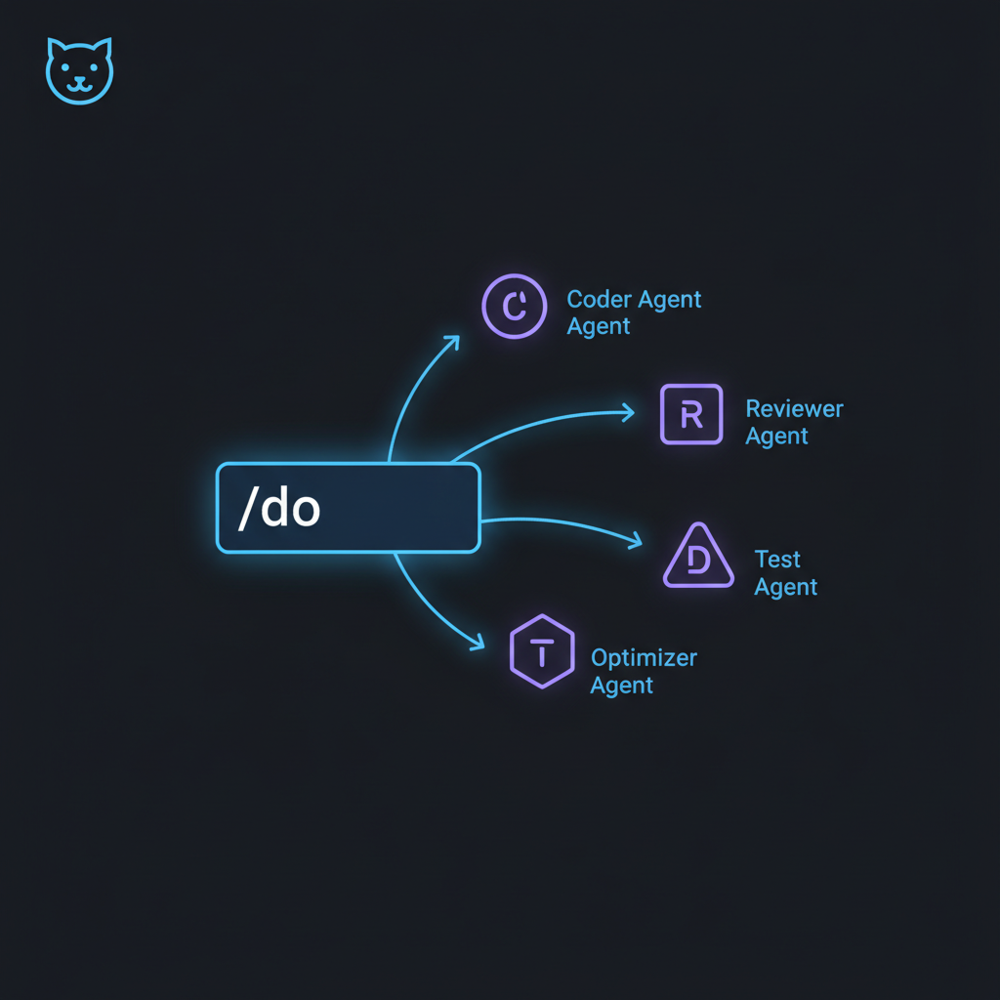

# VexJoy Agent



VexJoy Agent is a complete agent-driven workflow system for [Claude Code](https://docs.anthropic.com/en/docs/claude-code), [Codex](https://github.com/openai/codex), [Gemini CLI](https://github.com/google-gemini/gemini-cli), and [Factory](https://factory.ai). It gives all four CLIs domain-specific expertise, step-by-step workflows, and automated quality gates. The result is your coding agent working like a team of Go, Python, Kubernetes, review, and content specialists instead of one generalist.

## How It Works

It starts from the moment you type a request. You don't pick agents, configure workflows, or learn any internal concepts. You just say what you want done.

```
/do debug this Go test
```

In Claude Code, the smart router command is `/do`. In Codex, use `$do`. In Gemini CLI, use `/do` (Gemini discovers skills from `~/.gemini/skills/` automatically). In Factory, use `/do` (Factory discovers skills from `~/.factory/skills/` automatically).

```
  ROUTE          PLAN           EXECUTE        VERIFY         DELIVER
 ┌──────┐      ┌──────┐      ┌──────┐      ┌──────┐      ┌──────┐
 │ /do  │ ───▶ │Phase │ ───▶ │Agent │ ───▶ │Gates │ ───▶ │  PR  │
 │Router│      │ Plan │      │+Skill│      │ Test │      │Branch│
 └──────┘      └──────┘      └──────┘      └──────┘      └──────┘
```

A router reads your intent and selects a Go specialist agent paired with a systematic debugging methodology. The agent creates a branch, gathers evidence before guessing, runs through phased diagnosis, applies a fix, executes tests, reviews its own work, and presents a PR. You describe the problem. The system handles everything else.

This works because the toolkit separates *what you know* from *what the system knows*. Agents carry domain expertise (Go idioms, Python conventions, Kubernetes patterns). Skills enforce process methodology (TDD cycles, debugging phases, review waves). Hooks automate quality gates that fire on lifecycle events. Scripts handle deterministic operations where you want predictable output, not LLM judgment. The router ties it all together, classifying requests, selecting the right combination, and dispatching.

The result: consistent, domain-specific output across Go, Python, TypeScript, infrastructure, content, and more. No configuration required. A first-time user and a power user get the same quality results. The power user just understands why.

## Built with the Toolkit

A game built entirely by Claude Code using these agents, skills, and pipelines. Every step from design through implementation.

<div align="center">
<video src="https://github.com/user-attachments/assets/0e74abeb-dc7e-42ba-8239-a7a98cb1ab09" width="100%" autoplay loop muted playsinline></video>
</div>

## Installation

Requires [Claude Code](https://docs.anthropic.com/en/docs/claude-code) installed and working (`claude --version` should print a version number). Codex CLI, Gemini CLI, and Factory are also supported: the installer mirrors toolkit skills and agents into `~/.codex/`, `~/.gemini/`, and `~/.factory/` so all four CLIs can use the same skill and agent library.

```bash
git clone https://github.com/notque/vexjoy-agent.git ~/vexjoy-agent
cd ~/vexjoy-agent
./install.sh --symlink
```

The installer links agents, skills, hooks, commands, and scripts into `~/.claude/`, where Claude Code loads extensions from. It also mirrors skills and agents into `~/.codex/` for Codex, `~/.gemini/` for Gemini CLI, and `~/.factory/` for Factory. Use `--symlink` to get updates via `git pull`, or run without it for a stable copy.

Verify the install with:

```bash
python3 ~/.claude/scripts/install-doctor.py check
python3 ~/.claude/scripts/install-doctor.py inventory
```

If you update the repo later and want Codex/Gemini/Factory to see newly added skills, rerun `./install.sh --symlink` from the repo root.

Command entry points:
- Claude Code: `/do`
- Codex: `$do`
- Gemini CLI: `/do`
- Factory: `/do`

**Detailed setup:** [docs/start-here.md](docs/start-here.md)

<details>
<summary><b>Codex CLI Parity</b></summary>

The toolkit mirrors agents, skills, and a curated subset of hooks into `~/.codex/` so they work with the OpenAI Codex CLI alongside Claude Code. The mirror runs automatically on every `install.sh`; no flags required.

**What mirrors**

- **Agents**: every agent under `agents/` (and `private-agents/` if present) is copied or symlinked to `~/.codex/agents/`.
- **Skills**: every skill under `skills/`, `private-skills/`, and `private-voices/*/skill/` goes to `~/.codex/skills/`.
- **Hooks**: a Phase 1 allowlist of 6 hooks goes to `~/.codex/hooks/` with a matching generated `~/.codex/hooks.json`. The allowlist covers `SessionStart` injectors (KAIROS briefing, operator context, team config, rules distill), a `Stop` recorder (session learning), and a `PostToolUse` Bash scanner. See `scripts/codex-hooks-allowlist.txt`.
- **Feature flag**: `install.sh` sets `[features] codex_hooks = true` in `~/.codex/config.toml` using a TOML merge that preserves existing sections.

**What does not mirror (yet)**

- Edit/Write interceptors (ADR enforcement, creation protocol, config protection, plan gate, rename sweep, and similar) are Phase 2 and blocked on upstream [openai/codex#16732](https://github.com/openai/codex/issues/16732). Codex PreToolUse and PostToolUse only fire for the `Bash` tool today, so any hook guarding `Write` or `Edit` would register but never run.
- Codex does not support `PreCompact`, `SubagentStop`, `Notification`, or `SessionEnd` events; hooks on those events stay Claude Code only.
- Windows: Codex hook support is disabled upstream.
- Codex CLI v0.114.0 or later is required for hook activation. `install.sh` warns if the installed version is below that, and prints a neutral note if the `codex` binary is not found.

**Opting out**

There is no opt-out flag. The mirror is harmless when Codex CLI is not installed: `~/.codex/` entries sit unused until you install Codex. To skip the hooks portion, delete `~/.codex/hooks/` and `~/.codex/hooks.json` after install; the toolkit does not recreate them on normal use.

Upstream Phase 2 tracker: [openai/codex#16732](https://github.com/openai/codex/issues/16732).

</details>

<details>
<summary><b>Gemini CLI Support</b></summary>

The toolkit mirrors agents, skills, and a curated subset of hooks into `~/.gemini/` so they work with the Google Gemini CLI alongside Claude Code and Codex. The mirror runs automatically on every `install.sh`; no flags required.

**What mirrors**

- **Agents**: every agent under `agents/` (and `private-agents/` if present) is copied or symlinked to `~/.gemini/agents/`.
- **Skills**: every skill under `skills/`, `private-skills/`, and `private-voices/*/skill/` goes to `~/.gemini/skills/`.
- **Hooks**: the same Phase 1 hooks as Codex, with translated event names, go to `~/.gemini/hooks/`. Hook configuration is merged into `~/.gemini/settings.json` (only the `hooks` key is modified; all other settings are preserved). See `scripts/gemini-hooks-allowlist.txt`.

**Event name mapping**

| Claude/Codex | Gemini CLI |
|---|---|
| SessionStart | SessionStart |
| Stop | SessionEnd |
| PostToolUse | AfterTool |
| PreToolUse | BeforeTool |

Tool name mapping: Codex `Bash` becomes Gemini `run_shell_command`.

**Hook runtime compatibility**

Hooks can detect which CLI is invoking them via `detect_cli()` in `hooks/lib/hook_utils.py`. Normalization functions (`normalize_input()`, `detect_cli()`) are available in `hooks/lib/hook_utils.py` for hooks to import — they are not auto-applied. Output format (`hookSpecificOutput`) is shared across all three CLIs.

**Opting out**

The mirror is harmless when Gemini CLI is not installed. To remove hooks after install, delete `~/.gemini/hooks/` and remove the `hooks` key from `~/.gemini/settings.json`.

</details>

<details>
<summary><b>Factory CLI Support</b></summary>

The toolkit mirrors agents, skills, and a curated subset of hooks into `~/.factory/` so they work with the Factory CLI alongside Claude Code, Codex, and Gemini. The mirror runs automatically on every `install.sh`; no flags required.

**What mirrors**

- **Droids**: every agent under `agents/` (and `private-agents/` if present) is copied or symlinked to `~/.factory/droids/`. Factory calls agents "droids"; the directory name differs but the content is identical.
- **Skills**: every skill under `skills/`, `private-skills/`, and `private-voices/*/skill/` goes to `~/.factory/skills/`.
- **Hooks**: all hooks are mirrored to `~/.factory/hooks/` (no allowlist — same set as Claude Code). Hook configuration is merged into `~/.factory/settings.json` with paths rewritten from `$HOME/.claude/` to `$HOME/.factory/` (only the `hooks` key is modified; all other settings are preserved).

**Hook runtime compatibility**

Hooks can detect which CLI is invoking them via `detect_cli()` in `hooks/lib/hook_utils.py`. The same `normalize_input()` and `detect_cli()` normalization functions that support Codex and Gemini also cover Factory. Output format (`hookSpecificOutput`) is shared across all four CLIs.

**Opting out**

The mirror is harmless when Factory is not installed. To remove hooks after install, delete `~/.factory/hooks/` and remove the `hooks` key from `~/.factory/settings.json`.

</details>

<details>
<summary><b>Running Claude Code with the toolkit</b></summary>

The toolkit already supplies routing (`/do`), domain knowledge (agents), methodology (skills), and enforcement (hooks, CLAUDE.md). The shipped Claude Code system prompt, which is several thousand tokens, largely duplicates that structure for toolkit users. Override it to shrink per-request token cost:

```bash
claude --system-prompt "."
```

The `.` is just a non-empty placeholder (some shells reject an empty string). This is a token-economy and architectural-fit pattern, not a claim about output quality.

Trade-off: overriding the default strips Claude Code's built-in tool-use instructions and style guidance. That context comes back through the toolkit's own agents, skills, hooks, and CLAUDE.md, which is why the pattern fits here. On a bare Claude Code install without the toolkit, use `--append-system-prompt "..."` instead so the default guidance stays in place.

</details>

<details>
<summary><b>The Core Workflow</b></summary>

1. **Routing.** You type a request. The router entry point is `/do` in Claude Code, Gemini CLI, and Factory, and `$do` in Codex. It classifies intent, selects a domain agent and a workflow skill, and dispatches. No menus, no configuration.

2. **Planning.** For non-trivial work, the system creates a plan before touching code. Plans have phases, gates, and saved artifacts at each step.

3. **Execution.** A domain-specific agent handles the work using its skill's methodology. Go work gets Go idioms. Python work gets Python conventions. Reviews get multi-wave specialist panels.

4. **Quality gates.** Hooks fire automatically: anti-rationalization checks on code modifications, error learning after failures, context injection at session start. Quality is structural, not advisory.

5. **Verification.** Tests run. Deterministic scripts validate what LLM judgment cannot. The system does not claim completion without evidence.

6. **Delivery.** Changes land on a feature branch. PRs include lint checks, test runs, and review gates. Nothing merges without CI passing.

</details>

## What's Inside

<details>
<summary><b>44 Domain Agents</b> — domain-specific expertise across software, review, frontend, and infrastructure</summary>

Agents carry domain-specific expertise. Not thin wrappers that say "you are an expert," but concrete knowledge: version-specific idiom tables, anti-pattern catalogs with detection commands, error-to-fix mappings from real incidents.

| Category | Agents | Covers |
|---|---|---|
| Software Engineering | Go, Python, TypeScript, PHP, Kotlin, Swift, Node.js, React Native | Languages, DB design, data pipelines, SQLite/Peewee, K8s, Ansible, Prometheus/Grafana, OpenSearch, RabbitMQ, OpenStack |
| Code Review | Multi-perspective, domain-specific, playbook-enhanced | Newcomer/senior/pedant/contrarian/user-advocate, ADR compliance, adversarial verification |
| Frontend & Creative | React, Next.js, UI/UX, PixiJS, Rive, VFX | Portfolios, e-commerce, combat rendering, skeletal animation, performance, TS debugging |
| Infrastructure | Pipeline, project, research coordination | System upgrades, toolkit governance, tech docs, MCP server dev, Perses observability |

</details>

<details>
<summary><b>106 Workflow Skills</b> — phased methodologies with gates that prevent skipping steps</summary>

| Category | Key Skills | Use When |
|---|---|---|
| Development | TDD, systematic debugging, feature lifecycle, subagent-driven dev, pair programming | Building features, fixing bugs, writing tests |
| Code Quality | Parallel review (3 simultaneous), systematic review, cleanup, universal quality gates, linting | Reviewing code, enforcing standards |
| Content & Research | Voice-validated writing, research pipelines, content calendars, SEO, topic brainstorming, repurposing | Writing posts, researching topics, managing editorial |
| Operations | PR workflow, git commit flow, GitHub Actions, cron auditing, service health, K8s debugging | Shipping code, monitoring systems |
| Meta | Skill evaluation, agent comparison, A/B testing, toolkit evolution, reference enrichment, routing management | Improving the toolkit itself |

</details>

<details>
<summary><b>71 Hooks</b> — event-driven automation</summary>

Event-driven automation that fires on session start, before/after tool use, at compaction, and on stop. Error learning, context injection, quality enforcement, and anti-rationalization all run automatically.

</details>

<details>
<summary><b>93 Scripts</b> — deterministic Python utilities</summary>

Deterministic Python utilities for mechanical operations: INDEX generation, learning database management, voice validation, routing manifests, reference validation. LLMs orchestrate; programs execute.

</details>

```
┌─────────────────────────────────────────────────┐
│  SKILL.md                                       │
│  ┌─ Frontmatter ─────────────────────────────┐  │
│  │ triggers, pairs_with, success-criteria     │  │
│  └────────────────────────────────────────────┘  │
│  Reference Loading Table (conditional imports)   │
│  Phased Instructions (numbered, with gates)      │
│  Verification (evidence requirements)            │
└─────────────────────────────────────────────────┘
```

## Choose Your Path

**[I just want to use it](docs/start-here.md)** | Install in 2 minutes, learn a few commands. Done.

**[I do knowledge work](docs/for-knowledge-workers.md)** | Content pipelines, research workflows, community moderation. No code required.

**[I'm a developer](docs/for-developers.md)** | Architecture, extension points, how to add your own agents and skills.

**[I'm an AI power user](docs/for-ai-wizards.md)** | Routing tables, pipeline architecture, hook system, the learning database.

**[I'm an AI agent](docs/for-claude-code.md)** | Machine-dense component inventory. Tables, file paths, schemas, routing rules.

**[I'm on LinkedIn](docs/for-linkedin.md)** | 🚀 Thought leadership. Agree? 👇

## Philosophy

Tested principles, not aspirations. The toolkit absorbs complexity so the user does not have to.

- **Zero-expertise operation.** Say what you want done. The system classifies, selects specialists, enforces quality, and delivers. No agent names, no configuration, no prompt engineering.
- **LLMs orchestrate, programs execute.** Deterministic and measurable work belongs to scripts. LLM judgment is reserved for design decisions, contextual diagnosis, and code review.
- **Information density.** High fidelity, minimum words. Dense output beats verbose output. Complete results beat partial results. Every word should carry instruction, rule, or decision.
- **Tokens buy breadth, not depth.** Token spend goes toward more specialized agents analyzing in parallel, not longer prompts per agent. Right context ensures correctness; unfocused context adds cost without quality.
- **Agents carry the knowledge, not the model.** Agent quality is proportional to the specificity of attached knowledge, not the confidence of attached tone. A/B tested: domain knowledge and structured methodology beat motivational preambles every time.
- **Anti-rationalization as infrastructure.** Exit codes enforce what instructions cannot. Quality gates are structural, not advisory.
- **Everything should be a pipeline.** Complex work decomposes into phases. Phases have gates. Gates prevent cascading failures.

Full design philosophy: **[PHILOSOPHY.md](docs/PHILOSOPHY.md)**

## License

MIT. See [LICENSE](LICENSE).
