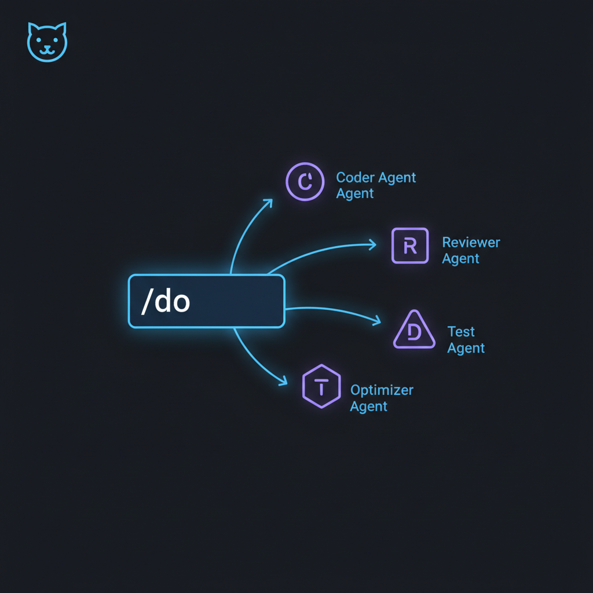

# VexJoy Agent



Essays and writing behind this toolkit live at [vexjoy.com](https://vexjoy.com).

VexJoy Agent connects plain-English requests to specialist agents, skills, and workflows. `/do` selects the knowledge and tools needed for your task. Hooks enforce specific checks, and scripts handle repeatable work.

The aim is to give capable models useful domain knowledge without making you learn the toolkit's catalog.

<!-- Counts here must match the Four Layers table (~line 143). Verify both: python138 scripts/validate-doc-counts.py -->
43 domain agents, 122 workflow skills, 76 hooks, 138 scripts. Agents carry knowledge, skills enforce methodology, hooks block incomplete work, scripts handle determinism.

Works across Claude Code (`/do`), Codex (`$do`), Factory (`/do`), Reasonix (`/do`).

## What It Looks Like

```
$ claude

> /do debug this Go test

  Routing: go-engineer + systematic-debugging
  Phase 1/4: Reproduce: running test, capturing failure...
  Phase 2/4: Hypothesize: 3 candidates from stack trace...
  Phase 3/4: Verify: isolated root cause in connection pool timeout
  Phase 4/4: Fix: patch applied, test passing, PR opened

  ✓ Delivered: PR #847, fix connection pool timeout in health check
```

The router pairs a Go agent with a debugging skill, then follows the task through verification and delivery.

## The Pipeline

```
  ROUTE        PLAN         EXECUTE      VERIFY       DELIVER      RECORD
 ┌──────┐    ┌──────┐    ┌──────┐    ┌──────┐    ┌──────┐    ┌──────┐
 │ /do  │───▶│ Task │───▶│Agent │───▶│Tests │───▶│  PR  │───▶│Route │
 │Router│    │ Plan │    │+Skill│    │Gates │    │Branch│    │Result│
 └──────┘    └──────┘    └──────┘    └──────┘    └──────┘    └──────┘
```

## Anti-Rationalization

Checks require evidence rather than confidence.

| Agent Says | What Happens |
|---|---|
| "Code looks correct, skip tests" | Exit gate requires test output. Blocked. |
| "Trivial change, no verification" | Hook blocks completion without evidence. |
| "Similar to before" | Skill demands case-specific proof. |
| "User is in a hurry" | Protocol overrides time pressure. |
| "I'm confident" | Gate demands exit code, not assertion. |

Hooks run at configured events. Skills state what to verify; blocking hooks enforce the checks they cover. Coverage depends on the runtime and tool path.

## Knowledge Work Is First-Class

The content engine researches, drafts in a calibrated voice, checks 397 writing patterns, and adapts finished pieces for each platform. `/html` produces a self-contained report, slide deck, prototype, chart, or diagram. It needs no coding or setup beyond installation.

## It Proves Its Own Changes

Toolkit changes use direct review and relevant checks. Model comparisons can settle specific uncertainties; they are not required for every edit. [PHILOSOPHY.md](docs/PHILOSOPHY.md) explains the validation policy. [what-didnt-work.md](docs/what-didnt-work.md) records failed experiments, routing reversals, unvalidated A/B citations, disabled lint rules, and program refutations.

The automated nightly evolution loop (`/evolve`, writes to `evolution-reports/`) ran regularly through mid-May 2026. It is currently dormant; recent evidence has come from manual PRs instead.

## Installation

```bash
git clone https://github.com/notque/vexjoy-agent.git ~/vexjoy-agent
cd ~/vexjoy-agent
./install.sh
```

Installs into `~/.claude/` and mirrors into `~/.codex/`, `~/.factory/`, and `~/.reasonix/` when the runtime command is on PATH or its home directory exists. Choose symlinks for live updates through `git pull`, or copies for a stable snapshot.

Want only part of the toolkit? Run `./install.sh --configure` to pick which skills, agents, and hooks install, or copy `.local.example/profile.yaml` to `.local/profile.yaml` and edit. No profile file = full install, unchanged behavior. Credit: [@thomasvan](https://github.com/thomasvan). Details: [.local.example/README.md](.local.example/README.md).

| CLI | Entry Point |
|-----|-------------|
| Claude Code | `/do` |
| Codex | `$do` |
| Factory | `/do` |
| Reasonix | `/do` |

**Full setup:** [docs/start-here.md](docs/start-here.md)

<details>
<summary><b>Codex CLI Parity</b></summary>

Mirrors agents, skills, and supported hooks into `~/.codex/`. The original six-hook allowlist was correct for Codex v0.114, when tool hooks only intercepted Bash. Current support requires Codex v0.144.1+ and classifies the 62 Claude hook registrations as **26 native, 27 adapter-backed, and 9 unsupported** (53 supported). These are registration counts, not unique hook files. The installer also preserves explicit per-subagent model routing for GPT-5.6 Sol by setting the MultiAgent V2 compatibility keys documented in [openai/codex#31814](https://github.com/openai/codex/issues/31814).

Codex now exposes `apply_patch` to tool hooks. VexJoy's adapter converts each patch operation into the Write/Edit payload expected by existing guards, but it cannot intercept writes performed through `unified_exec`, unmatched MCP tools, WebSearch, or other unsupported tool paths. PreCompact and Stop adapters also receive less telemetry than Claude Code: Codex does not provide Claude's `conversation_history` or `session_data`. This is expanded compatibility, not full Claude parity.

After install or any hook-definition change, run `/hooks` in Codex and review the new definitions before trusting them. Codex hash-trusts hook commands and skips changed, unreviewed definitions.

</details>

<details>
<summary><b>Gemini CLI / Antigravity CLI Support (removed)</b></summary>

Gemini CLI support removed (deprecated upstream, transitioned to Antigravity CLI); Antigravity support pending CLI maturity. Per Google's [transition announcement](https://developers.googleblog.com/an-important-update-transitioning-gemini-cli-to-antigravity-cli/), Gemini CLI stops serving requests on **2026-06-18** for Google AI Pro / Ultra and free Gemini Code Assist for individuals. Gemini **API** integrations (image-gen backends, sprite pipeline, `GEMINI_API_KEY`) are unaffected and stay in the toolkit.

If a prior install mirrored into `~/.gemini/`, remove the stale mirrors with:

```bash
rm -rf ~/.gemini/skills ~/.gemini/agents ~/.gemini/hooks ~/.gemini/scripts ~/.gemini/antigravity/plugins/vexjoy-agent
```

</details>

<details>
<summary><b>Factory CLI Support</b></summary>

Mirrors agents (as "droids"), skills, and all hooks into `~/.factory/`. Hook config merges into `~/.factory/settings.json` with paths rewritten.

</details>

<details>
<summary><b>Reasonix Support</b></summary>

Mirrors skills, scripts, and the allowlisted hooks (`scripts/reasonix-hooks-allowlist.txt`) into `~/.reasonix/` (no agent or custom-command surface, so neither is installed; the `/do` router rides in as a skill). Reasonix fires only 4 events (PreToolUse, PostToolUse, UserPromptSubmit, Stop), so only hooks for those events are allowlisted. Hook config is written to the `hooks` key of `~/.reasonix/settings.json` in Reasonix's native flat shape (one entry per hook, `match` regex over the tool name); the generator builds absolute `python3` commands, so no path rewrite is applied. MCP/model/permissions in `~/.reasonix/config.json` are user-owned and left untouched.

</details>

<details>
<summary><b>Token-saving mode</b></summary>

The toolkit supplies its own routing, domain knowledge, methodology, and enforcement. The default system prompt duplicates most of that.

```bash
claude --system-prompt "."
```

Strips built-in tool-use instructions. The toolkit's agents, skills, hooks, and CLAUDE.md provide equivalent coverage.

</details>

## Four Layers

<!-- Counts here must match the intro line (~line 13). Verify both: python3 scripts/validate-doc-counts.py -->

| Layer | Count | Does |
|---|---|---|
| Agents | 43 | Domain knowledge: idiom tables, failure mode catalogs, error-to-fix mappings |
| Skills | 122 | Phased methodology with gates. Can't skip steps. Each phase has exit criteria requiring evidence. |
| Hooks | 76 | Fire on lifecycle events. Block incomplete work. Zero LLM cost. |
| Scripts | 138 | Determinism: test runners, linters, validators. No LLM judgment. |

Full skill catalog: [docs/skills.md](docs/skills.md).

```
┌─────────────────────────────────────────────────┐
│  SKILL.md                                       │
│  ┌─ Frontmatter ─────────────────────────────┐  │
│  │ triggers, pairs_with, success-criteria     │  │
│  └────────────────────────────────────────────┘  │
│  Reference Loading Table (conditional imports)   │
│  Phased Instructions (numbered, with gates)      │
│  Verification (evidence requirements)            │
└─────────────────────────────────────────────────┘
```

## Built with the Toolkit

A game built entirely by Claude Code using these agents, skills, and pipelines:

<div align="center">
<video src="https://github.com/user-attachments/assets/0e74abeb-dc7e-42ba-8239-a7a98cb1ab09" width="100%" autoplay loop muted playsinline></video>
</div>

## Choose Your Path

**[I just want to use it](docs/start-here.md)** Install, learn `/do`, done.

**[I do knowledge work](docs/for-knowledge-workers.md)** Writing, research, data analysis, moderation, HTML artifacts. No code.

**[I'm a developer](docs/for-developers.md)** Architecture, extension points, adding agents and skills.

**[I'm an AI power user](docs/for-ai-wizards.md)** Routing tables, pipelines, hooks, telemetry DB.

**[I'm an AI agent](docs/for-claude-code.md)** Machine-dense inventory. Tables, paths, schemas.

**[I'm on LinkedIn](docs/for-linkedin.md)** 🚀 Thought leadership. Agree? 👇

## Philosophy

- **Zero-expertise operation.** Say what you want. The system classifies, dispatches, enforces, delivers.
- **LLMs orchestrate, programs execute.** Deterministic work belongs to scripts. LLM judgment handles design decisions, diagnosis, review.
- **Density.** Every word carries instruction, rule, or decision. Cut everything else.
- **Breadth over depth.** Right context ensures correctness. Unfocused context adds cost.
- **Structural enforcement.** Exit codes enforce what instructions can't. Quality gates are automated, not advisory.
- **Everything pipelines.** Complex work decomposes into phases. Phases have gates. Gates prevent cascading failures.

Full design philosophy: **[PHILOSOPHY.md](docs/PHILOSOPHY.md)**

## Maintenance

One report-only script surfaces upkeep work; it prints a digest and never edits, deletes, or blocks.

- `python3 scripts/stale-skill-scan.py --top 20` ranks stale skills and agents as pruning candidates. Run it quarterly; see [docs/deprecation-template.md](docs/deprecation-template.md).

Scheduled work follows the same boundary as everything else: judgment uses agents; repeatable plumbing uses scripts.

| Need | Use |
|---|---|
| Run a deterministic command on a schedule | `scripts/agent-scheduler.py` with `runner: "command"` |
| Run an agent judgment on a schedule, webhook, or file change | `scripts/agent-scheduler.py` with the default `runner: "claude"` |
| Install or remove a user crontab entry safely | `scripts/crontab-manager.py` |
| Audit shell cron reliability | `cron-automation` |
| Keep one interactive objective moving until criteria verify | `objective-loop` |

## Contributing

See [CONTRIBUTING.md](CONTRIBUTING.md).

## License

MIT. See [LICENSE](LICENSE).
